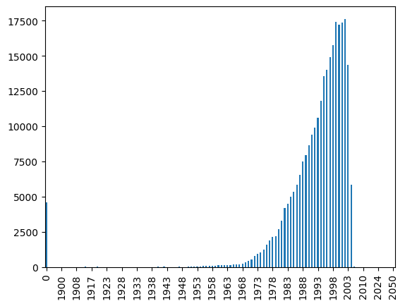
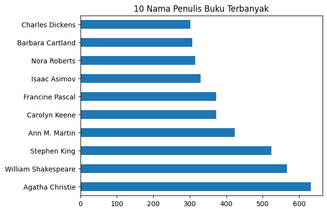
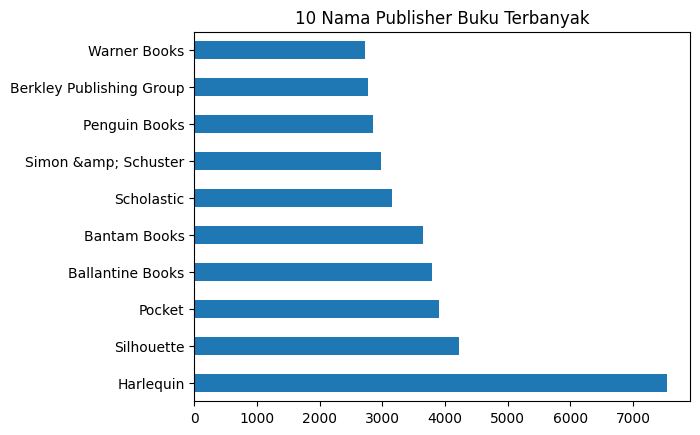
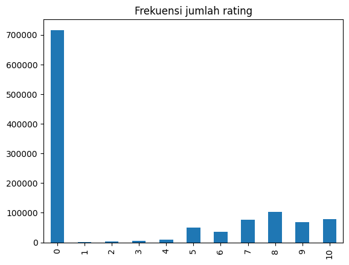
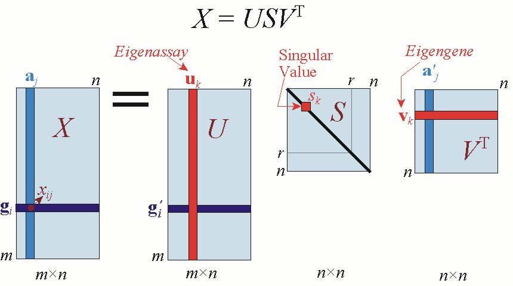
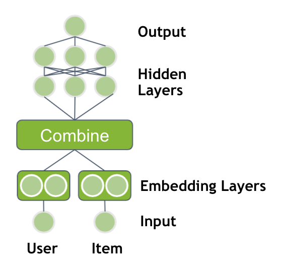

# Laporan Proyek Machine Learning - Sulistyo Chandrianto

## Project Overview

Ilmu pengetahuan sangatlah penting bagi umat manusia. Dari ilmu pengetahuan manusia dapat belajar banyak hal dari berbagai sisi kehidupan. Salah satu kunci meningkatkan kualitas hidup manusia adalah mengerti akan ilmu pengetahuan tersebut sehingga manusia perlu untuk belajar apa itu ilmu pengetahuan. Cara mudah untuk mengakses ilmu pengetahuan adalah dengan membaca buku. Dari buku manusia dapat membaca tulisan-tulisan gagasan ilmu dari penulis dalam bentuk cerita naratif, cerita bergambar dan lainnya. Melalui membaca manusia dapat mengerti berbagai hal yang belum dimengerti sebelumnya. 

Ada sebuah pernyataan yaitu bahwa buku membuka jendela wawasan manusia namun sayangnya minat membaca buku di Indonesia sangat kecil. Di tingkat internasional, Indonesia memiliki indeks membaca sebesar 0,001 yang artinya setiap seribu orang hanya satu orang yang memiliki minat baca tinggi [[1](https://journal.unesa.ac.id/index.php/jpi/article/view/140)]. Hal ini berbeda jika dibandingkan dengan negara maju seperti Amerika yang memiliki indeks membaca sebesar 0,45 dan Singapura yang memiliki indeks baca 0,55. Terlihat negara maju memiliki masyarakat dengan minat baca yang tinggi sehingga penting sekali meningkatkan minat membaca ini di Indonesia.

Kesusahan mencari buku yang menarik untuk dibaca merupakan salah satu kendala seseorang untuk memulai membaca buku. Terdapat banyak jenis buku dengan banyak judul yang siap dibaca. Namun seringkali terlewat begitu saja karena tidak adanya bantuan dalam pemilihan buku tersebut. Hal ini menyebabkan minat seseorang cepat hilang dan menyerah. Maka dari itu diperlukan sebuah sistem pendukung untuk mengatasi permasalahan ini. 

Sistem pendukung yang bisa digunakan adalah sistem rekomendasi buku. Sistem rekomendasi buku merupakan sistem yang akan merekomendasikan buku sehingga seseorang dapat lebih mudah mendapatkan informasi tentang buku yang akan dibaca [[2](https://ejournal.akprind.ac.id/index.php/technoscientia/article/view/612)]. Sistem rekomendasi ini dibangun berdasarkan sejarah ulasan dari pembaca lainnya sehingga dapat memberikan judul-judul buku yang menarik untuk dibaca. Sistem rekomendasi buku ini diharapkan dapat memberikan bantuan kepada pembaca baru untuk lebih mudah dipertemukan dengan buku yang menarik minat bacanya. Pendekatan yang akan digunakan dalam pengembangan sistem rekomendasi buku adalah *collaborative filtering* yang memerlukan informasi sumber data dari pembaca lainnya.


## Business Understanding

### Problem Statements

Berdasarkan permasalahan yang sudah dijelaskan dapat dirumuskan masalah sebagai berikut:

- Bagaimana cara mengembangkan sistem rekomendasi buku yang dapat meningkatkan minat baca ?
- Apa teknik  yang tepat dan akurat untuk metode *collaborative filtering*  dalam pengembangan sistem rekomendasi buku ini ?

### Goals

Tujuan dari proyek ini adalah sebagai berikut:

- Mengembangkan sistem rekomendasi buku yang dapat meningkatkan minat baca berdasarkan ulasan pembaca lainnya.
- Memilih teknik yang tepat yang tepat dan akurat untuk metode *collaborative filtering*  untuk pengembangan sistem rekomendasi buku ini.

### Solution statements

Untuk mencapai tujuan pengembangan sistem rekomendasi buku digunakan metode *collaborative filtering* dengan teknik *Singular Value Decomposition* (SVD) dan *Neural Network*. Kedua teknik ini akan dibandingkan dan dipilih yang terbaik. Berikut penjelasan 2 teknik tersebut.

- *Collaborative Filtering* dengan teknik *Single Value Decomposition* (SVD)

  SVD adalah teknik faktorisasi matriks yang mereduksi dimensi matriks menjadi dimensi yang lebih kecil. Di sistem rekomendasi, SVD akan mengklasifikasi *users* sesuai dengan atributnya kemudian dilakukan *decompose* matrix *rating*. SVD akan menggabungkan matriks atribut *users* dengan matriks *rating* tadi untuk mendapat matrik baru yang dapat dihitung kesamaannya berdasarkan pasangan *users* [[3](https://ieeexplore.ieee.org/abstract/document/6615466)].

- *Collaborative Filtering* dengan teknik *Neural Network*.

  *Neural Network* adalah algoritma *machine learning* yang meniru sistem jaringan saraf manusia. *Neural Network* dapat dikombinasikan dengan metode *collaborative filtering* untuk bisa mendapatkan esensi *progressive learning*. *Neural Network* dapat mengenali pola implisit antara profil *user* dengan *items* [[4](https://dl.acm.org/doi/abs/10.5555/1983862.1983922)].

## Data Understanding

Dataset yang digunakan untuk pengembangan sistem rekomendasi buku diambil dari kaggle yaitu [Book Recommendation Dataset](https://www.kaggle.com/datasets/arashnic/book-recommendation-dataset). Dataset ini berisi data buku (*books*), data pembaca (*users*) dan data penilaian (*ratings*). Terdapat 278.858 data pembaca dengan data penilaian sebanyak 1.149.780 untuk 271.360 buku. Dataset ini memiliki 3 file dengan ekstensi *comma separated value* yaitu `Books.csv`, `Ratings.csv` dan `Users.csv`

Berikut penjelasan untuk masing-masing file yang terdapat di dataset ini.

- File `Books.csv` : file ini berisi informasi tentang buku yang diambil dari *Amazon Web Services*
- File `Users.csv`: file ini berisi informasi tentang pembaca yaitu user ID yang sudah dianonimkan dan informasi demografi pembaca.
- File `Ratings.csv` : file ini berisi informasi penilaian pembaca terhadap buku dengan skala 0 sampai 10, semakin tinggi nilai semakin tinggi apresiasi pembaca terhadap buku yang dinilai.

Fitur-fitur yang terdapat pada data adalah sebagai berikut :

Fitur Data *Books*

* ISBN : *International Standard Book Number* yaitu kode unik buku
* Book-Title : judul buku
* Book-Author : penulis  buku
* Year-Of-Publication : tahun terbit buku
* Publisher : nama penerbit buku
* Image-URL-S : alamat url gambar buku dengan ukuran kecil di situs amazon
* Image-URL-M : alamat url gambar buku dengan ukuran sedang di situs amazon
* Image-URL-L : alamat url gambar buku dengan ukuran besar di situs amazon

Fitur Data *Users*

- User-ID : kode ID pembaca dalam bentuk *integer*
- Location : lokasi tempat tinggal pembaca
- Age : umur dari pembaca

Fitur Data *Ratings*

- User-ID : kode ID pembaca
- ISBN : kode unik buku
- Book-Rating : nilai *rating* dari buku yang dibaca dengan rentang nilai dari 0 sampai 10. Nilai rating 0 berarti belum memberikan rating

### Univariate Analysis

Dilakukan analisa dengan teknik *univarate* EDA untuk mengetahui informasi yang ada pada variabel di dataset. Analisa hanya dilakukan di beberapa variabel sesuai dengan kebutuhan sistem rekomendasi.

**Variabel Year-Of-Publication**



Gambar 1. Grafik Persebaran Jumlah Data Variabel Year-Of-Publication

Pada Gambar 1 terlihat data persebaran jumlah data variabel Year-Of-Publication ditemukan informasi data tahun terbit buku didominasi nilai dengan rentang tahun 1968 - 2003 sedangkan untuk tahun terbit 0 menunjukkan buku tidak memiliki data tahun terbit.

Selain itu dari hasil eksplorasi ditemukan informasi bahwa:

* Terdapat tahun terbit buku yang lebih besar dari tahun 2023 yaitu 2024, 2026, 2030, 2038, 2037, 2050
* Terdapat tahun terbit buku yang bukan dalam bentuk angka tetapi kata yaitu 'DK Publishing Inc' dan 'Gallimard'

**Variabel Book-Author**

Tabel 1. Tabel Jumlah Data dan Persentase Variabel Book-Author

| Book-Author          | Jumlah Record | Persentase |
| -------------------- | ------------- | ---------- |
| Agatha Christie      | 632           | 0.2        |
| William Shakespeare  | 567           | 0.2        |
| Stephen King         | 524           | 0.2        |
| Ann M. Martin        | 423           | 0.2        |
| Carolyn Keene        | 373           | 0.1        |
| ...                  | ...           | ...        |
| Linda Jackson        | 1             | 0.0        |
| Artiste C. Arthur    | 1             | 0.0        |
| Emily Pearl Kingsley | 1             | 0.0        |
| Jean Cassels         | 1             | 0.0        |
| Christopher  Biffle  | 1             | 0.0        |




Gambar 2. Sepuluh Nama Penulis Terbanyak yang muncul di dataset

Dilihat dari Tabel 1 dan Gambar 2 didapatkan informasi sebagai berikut :

- Terdapat 102.023 nama penulis buku
- Persentase penulis buku terbesar adalah 0.2 % sehingga dapat disimpulkan nilai dari variabel Book-Author memiliki keragaman data yang banyak dan tidak didominasi oleh penulis buku tertentu
- 3 Penulis buku terbanyak yang sering muncul di dataset adalah Agatha Christie, William Shakespeare dan Stephen King

**Variabel Publisher**

Tabel 2. Jumlah Data dan Persentase Variabel Publisher

| Publisher               | Jumlah Record | Persentase |
| ----------------------- | ------------- | ---------- |
| Harlequin               | 7535          | 2.8        |
| Silhouette              | 4220          | 1.6        |
| Pocket                  | 3905          | 1.4        |
| Ballantine Books        | 3783          | 1.4        |
| Bantam Books            | 3646          | 1.3        |
| ...                     | ...           | ...        |
| Hannover House          | 1             | 0.0        |
| Amber Quill Press, LLC. | 1             | 0.0        |
| Lunchbox Press          | 1             | 0.0        |
| Ugly Town               | 1             | 0.0        |
| Connaught               | 1             | 0.0        |



Gambar 3. Sepuluh Nama Penerbit Buku Terbanyak yang muncul di dataset

Dilihat dari Tabel 2 dan Gambar 3 didapatkan informasi sebagai berikut :

* Terdapat 16.807 nama penerbit buku
* Persentase penerbit buku terbanyak adalah 2.8 % yaitu Harlequin selisih 1% dengan publisher peringkat kedua yaitu Silhouette
* 3 penerbit buku terbanyak adalah Harlequin, Silhouette dan Pocket

**Variabel Book-Rating**

Tabel 3. Jumlah Data dan Persentase Variabel Book-Rating

| Book-Rating | Jumlah Record | Persentase |
| ----------- | ------------- | ---------- |
| 0           | 716109        | 62.3       |
| 8           | 103736        | 9.0        |
| 10          | 78610         | 6.8        |
| 7           | 76457         | 6.6        |
| 9           | 67541         | 5.9        |
| 5           | 50974         | 4.4        |
| 6           | 36924         | 3.2        |
| 4           | 8904          | 0.8        |
| 3           | 5996          | 0.5        |
| 2           | 2759          | 0.2        |
| 1           | 1770          | 0.2        |



Gambar 4. Visualisasi Frekuensi Jumlah Rating di dataset

Dilihat dari Tabel 3 dan grafik Gambar 4 didapatkan informasi sebagai berikut :

* Jumlah pembaca yang belum memberikan penilaian ke buku (rating = 0) masih sangat banyak yaitu sebesar 62% dari dataset
* Nilai rating yang sering muncul setelah rating 0 adalah rating 8 dengan persentase 8% dari dataset

## Data Preprocessing

Dataset yang akan digunakan perlu olah telebih dahulu sebelum masuk ke tahap *data preparation*. Hal ini dikarenakan sumber data yang terpisah di 3 file *comma separated value*. Langkah-langkah yang dilakukan di tahap ini adalah sebagai berikut :

* **Penggabungan Data**. Sumber data masih terpisah-pisah di file `Books.csv`, `Ratings.csv` dan `Users.csv` sehingga dilakukan penggabungan data Books.csv dengan Ratings.csv berdasarkan variabel ISBN sebagai kode unik buku. Data `Users.csv` tidak ikut digabungkan karena fokus sistem rekomendasi buku ini tidak mengambil informasi umur dan demografi dari pembaca.
* **Penghapusan Variabel**. Pada dataset yang sudah digabungkan masih terdapat variabel-variabel yang tidak digunakan dalam proses pembuatan model sehingga perlu dihapus untuk mengurangi dimensi. Variabel yang akan digunakan adalah User-Id, ISBN dan Book-Rating selain dari variabel yang disebutkan akan dihapus.

## Data Preparation

Langkah-langkah yang dilakukan untuk menyiapkan data (*data preparation*) adalah sebagai berikut :

* **Penanganan Nilai yang Hilang (*Missing Value*)**. Pada dataset proyek ini tidak ditemukan nilai data yang hilang sehingga tidak dilakukan proses penanganan nilai yang hilang.
* ***Encoding Data***.Dilakukan *encoding data*  yaitu proses pengkodean data dari satu format ke format lain agar lebih mudah dalam diproses. *Encoding data* yang dilakukan untuk variabel ISBN dan User-ID ke dalam indeks *integer*. Hal ini dilakukan untuk mempermudah proses training data nantinya.
* **Skala Ulang Variabel**. Dilakukan skala ulang variabel yaitu mengubah nilai menjadi skala tertentu. Skala ulang dilakukan terhadap variabel Book-Rating menjadi skala 0 sampai 1. Hal ini dilakukan agar mempermudah proses training model dan lebih mudah dibaca oleh model.
* **Pembagian Data Latih dan Data Uji**.Pembagian data dilakukan uji dan latih dilakukan dengan perbandingan 80% data latih dan 20% data uji. Di proyek ini menggunakan dua cara pembagian data latih dan data uji yaitu pembagian data latih dan data uji menggunakan [train_test_split](https://surprise.readthedocs.io/en/stable/model_selection.html#surprise.model_selection.split.train_test_split) *library* surprise yang akan digunakan untuk model dengan teknik SVD kemudian pembagian data latih dan data uji menggunakan pembagian data dengan persentase untuk model dengan teknik *Neural Network*.

## Modeling

Pada proyek ini berfokus di metode *collaborative filtering* yaitu metode yang menyajikan data rekomendasi berdasarkan perilaku pengguna lain. Informasi yang digunakan sebagai acuan rekomendasi adalah penilai pembaca terhadap buku yang disimpan di variabel Book-Rating. Terdapat dua teknik yang digunakan untuk membuat sistem rekomendasi buku dengan *collaborative filtering* di proyek ini yaitu

* *Collaborative filtering* dengan teknik SVD (*Single Value Decomposition*). Implementasi model SVD di proyek ini menggunakan library [Surprise](https://surprise.readthedocs.io/en/stable/getting_started.html). Cara kerja **collaborative filtering* dengan teknik SVD adalah dengan menggunakan matriks  yang setiap barisnya merepresentasikan pembaca dan kolomnya merepresentasikan buku kemudian dilakukan faktorisasi matriks  dengan SVD yang akan mengekstrak *latent factor* menghasilkan pemetaan relasi antara pembaca dan buku. SVD memecah matriks menjadi 3 matriks yaitu matriks U yang merepresentasikan hubungan antara pembaca dengan *latent factor*, matriks S merupakan matriks  diagonal yang merepresentasikan tingkat variasi dari *latent factor* dan matriks V yang merepresentasikan hubungan antara buku dengan *latent factor*. *Latent factor*  adalah karakteristik dari buku yang digunakan dalam hal ini variabel Book-Rating.

  

  

  Gambar 5. Tampilan Rumus SVD untuk Dekomposisi Matriks

  Kelebihan dan kekurangan SVD dijelaskan dibawah ini :

  * Kelebihan
    * Mereduksi dimensi
    * Efisien dalam proses komputasi
  * Kekurangan
    * Membutuhkan resource yang lebih besar untuk komputasi dataset yang sangat besar
    * Sensitif terhadap data *outliers*

  

  Hasil dari prediksi  dapat dilihat di Tabel 4.

  Tabel 4. Daftar 8 teratas rekomendasi buku untuk pembaca dengan User-ID 276729 dengan teknik SVD

  | ISBN       | Book-Title                                                   | Book-Author      |
  | ---------- | ------------------------------------------------------------ | ---------------- |
  | 034545104X | Flesh Tones: A Novel                                         | M. J. Rose       |
  | 0671665871 | GOING HOME                                                   | Danielle Steel   |
  | 0671690582 | WHISPER OF DEATH : WHISPER OF DEATH                          | Christopher Pike |
  | 0671690094 | ANNE FRANK: DIARY OF A YOUNG GIRL                            | Anne Frank       |
  | 067167630X | BOOMER                                                       | Charles Taylor   |
  | 067167465X | BEST OF ENEMIES (NANCY DREW HARDY BOY SUPERMYSTERY 9) : BEST OF ENEMIES (Nancy Drew and Hardy Boys Supermystery) | Carolyn Keene    |
  | 0671673513 | The SILENCE OF THE LAMBS                                     | Thomas Harris    |
  | 0671670662 | WEB OF DREAMS (Casteel Saga (Paperback))                     | V.C. Andrews     |

  

* *Collaborative filtering* dengan teknik *Neural Network*. Pada proyek ini implementasi *collaborative filtering* dengan teknik Neural Network menggunakan bantuan Keras model yang terinspirasi dari *class* [RecommenderNet](https://keras.io/examples/structured_data/collaborative_filtering_movielens/). Model *Neural Network* yang digunakan menggunakan BinaryCrossentropy sebagai *loss function*, Adam (*Adaptive Moment Estimation*) sebagai *optimizer* dan RMSE (*Root Mean Square Error*) sebagai matriks evaluasi. Hyperparameter yang digunakan adalah epoch sebesar 8 dan batch_size sebesar 500. Nilai ini didapatkan dengan cara *trial and error.*

  Proses yang ada di model RecommenderNet adalah *match score* antara pembaca dan buku dihitung menggunakan *dot product* kemudian hasil ini ditambahkan dengan nilai bias pembaca dan bias buku. Hasil akhir akan di skala ulang dengan nilai 0 sampai 1 menggunakan *sigmoid activation* yang mana nilai rating sudah di skala ulang menjadi 0 sampai 1 di tahap persiapan data. Jumlah *embedding layer* yang digunakan adalah 4. Ilustrasi cara kerja *Neural Network* dapat dilihat di Gambar 9.

  

  Gambar 6. Ilustrasi Cara Kerja Neural Network di Sistem Rekomendasi

  * Kelebihan
    * Bagus untuk model dengan input dengan banyak dimensi
    * Didesain untuk melakukan pembelajaran yang berkelanjutan (**continuous learning*)
  * Kekurangan
    * Memakan banyak waktu dalam proses pelatihan data
    * Bergantung kepada data latih sehingga rentan terhadap *overfitting*

  

  Hasil dari prediksi  dapat dilihat di Tabel 5.

  Tabel 5. Daftar 8 teratas rekomendasi buku untuk pembaca dengan User-ID 276729 dengan teknik *Neural Network*

  | ISBN       | Book-Title                                                   | Book-Author        |
  | ---------- | ------------------------------------------------------------ | ------------------ |
  | 0737020601 | Desserts: Delicious Desserts from the 50's (Retro Recipes)   | Susan Wolk         |
  | 0486229777 | Best Ghost Stories of Algernon Blackwood                     | Algernon Blackwood |
  | 0340670363 | How to Win at Horse Racing (Teach Yourself: How to Win)	Belinda Levez | Belinda Levez      |
  | 1864364408 | The Last Mortal Generation: How Science Will Alter Our Lives in the 21st Century | Damien Broderick   |
  | 0824521056 | Running from the Devil: A Memoir of a Boy Possessed          | Steve Kissing      |
  | 0765305534 | Louisiana Lament (Talba Wallis)	Julie Smith               | Julie Smith        |
  | 0521576814 | The Functional Approach to Programming	Guy Cousineau      | Guy Cousineau      |
  | 0425089835 | Nice Girls Do	Irene Kassorla                              | Irene Kassorla     |

  

## Evaluation

Metric yang digunakan untuk mengevaluasi model adalah RMSE (*Root Mean Squared Error*). RMSE menghitung akar dari rata-rata selisih kuadrat antara nilai prediksi dan nilai aktual atau bisa dikatakan akar kuadrat dari MSE (*Mean Squared Error*). Nilai RMSE yang kecil menunjukkan performa model yang lebih baik dan akurat.

Rumus RMSE


```
Dengan n = jumlah dataset, yi = nilai sebenarnya , ŷi = nilai prediksi
```

Nilai dari RMSE dari tiap pendekatan model dapat dilihat di Tabel 1.

Tabel 3. Tabel Hasil RMSE (*Root Mean Squared Error*) tiap model

|                | test     |
| -------------- | -------- |
| SVD            | 0,343799 |
| Neural Network | 0,339373 |

Dari Tabel 3 terlihat bahwa  nilai RMSE untuk teknik SVD dan teknik *Neural Network* memiliki selisih nilai yang kecil sehingga kedua teknik ini dapat dikatakan cocok digunakan untuk sistem rekomendasi buku dengan  metode *collaborative filtering*. Selain itu nilai RMSE sebesar 0.3 sudah cukup baik dalam implementasi sistem rekomendasi buku ini. Namun teknik *Neural Network* memiliki nilai RMSE yang lebih kecil dan nilai ini bisa ditingkatkan lagi melihat hyperparameter yang digunakan masih dapat di optimasi sehingga teknik yang dipilih dalam proyek ini adalah *Neural Network.*

## Kesimpulan

Dari tahapan yang sudah dilakukan sudah berhasil dibuat sistem rekomendasi buku dengan metode *collaborative filtering* dengan teknik SVD dan *Neural Network*. Sistem rekomendasi yang dibuat menggunakan data rating dari pembaca lainnya sebagai acuan sehingga akan merekomendasikan buku yang dianggap menarik oleh pembaca lainnya. Diharapkan dengan merekomendasi buku-buku yang menarik, pembaca baru dapat mulai tertarik untuk memulai membaca buku sehingga meningkatkan minat baca buku di Indonesia. 

Dari kedua teknik yang digunakan di proyek ini, keduanya memiliki kecocokan ketika diterapkan dalam membangun sistem rekomendasi buku dilihat dari nilai RMSE yang cukup kecil. Dari kedua teknik yaitu teknik SVD dan teknik Neural Network, teknik Neural Network yang dipilih sebagai teknik yang lebih akurat dan tepat. Teknik *Neural Network* dipilih karena memiliki banyak ruang untuk peningkatan performa dalam merekomendasikan buku selain itu hasil RMSE dari teknik *Neural Network* lebih kecil dari teknik SVD. Peningkatan performa ini dapat dilakukan dengan cara mengatur hyperparameter epoch, batch_size serta memperbaiki kualitas data latih. 

## Referensi

[[1](https://journal.unesa.ac.id/index.php/jpi/article/view/140)] Kasiyun, Suharmono. "Upaya meningkatkan minat baca sebagai sarana untuk mencerdaskan bangsa." (2015): 81.

[[2](https://ejournal.akprind.ac.id/index.php/technoscientia/article/view/612)] Irfan, Mohammad, and Andharini Dwi Cahyani. "Sistem Rekomendasi: Buku Online Dengan Metode Collaborative Filtering." *Jurnal Teknologi Technoscientia* (2014): 076-84.

[[3](https://ieeexplore.ieee.org/abstract/document/6615466)] Ba, Qilong, Xiaoyong Li, and Zhongying Bai. "Clustering collaborative filtering recommendation system based on SVD algorithm." *2013 IEEE 4th International Conference on Software Engineering and Service Science*. IEEE, 2013.

[[4](https://dl.acm.org/doi/abs/10.5555/1983862.1983922)] Vassiliou, Charalampos, et al. "A recommender system framework combining neural networks & collaborative filtering." *Proceedings of the 5th WSEAS international conference on Instrumentation, measurement, circuits and systems*. 2006.
